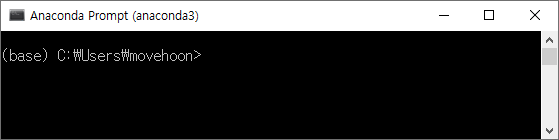
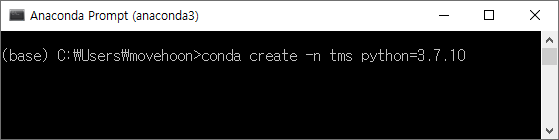
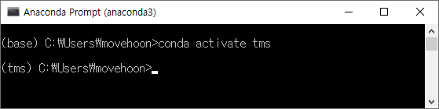
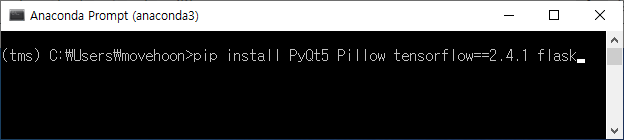
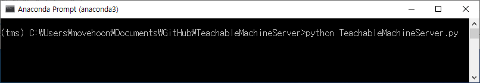

# TeachableMachineServer
Run keras model of [teachable machine](https://teachablemachine.withgoogle.com/)

## Make Environments
1. Install [Anaconda](https://www.anaconda.com/)

2. Run Anaconda Prompt



3. Create virtual environment
```
conda create -n tms python=3.7.10
```


4. Switch to virtual environment
```
conda activate tms
```


5. Install modules
```
pip install PyQt5 Pillow tensorflow==2.4.1 flask 
```


6. Move to project directory and Execute
```
python TeachableMachineServer.py
```


6. Open Model

7. Image Open for test

8. Start Server

9. Check running on browser
http://localhost:5000

